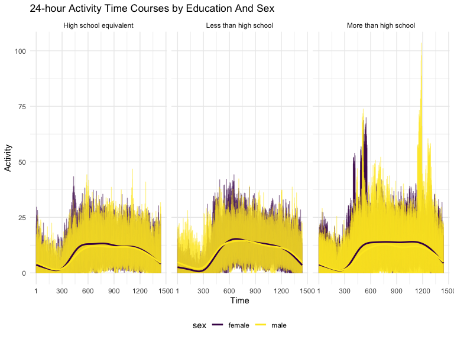

p8105_hw3_zz3168
================
Zixuan Zhang
2023-10-10

``` r
library(p8105.datasets)
data("instacart")
library(tidyverse)
```

    ## ── Attaching core tidyverse packages ──────────────────────── tidyverse 2.0.0 ──
    ## ✔ dplyr     1.1.3     ✔ readr     2.1.4
    ## ✔ forcats   1.0.0     ✔ stringr   1.5.0
    ## ✔ ggplot2   3.4.3     ✔ tibble    3.2.1
    ## ✔ lubridate 1.9.2     ✔ tidyr     1.3.0
    ## ✔ purrr     1.0.2     
    ## ── Conflicts ────────────────────────────────────────── tidyverse_conflicts() ──
    ## ✖ dplyr::filter() masks stats::filter()
    ## ✖ dplyr::lag()    masks stats::lag()
    ## ℹ Use the conflicted package (<http://conflicted.r-lib.org/>) to force all conflicts to become errors

``` r
library(p8105.datasets)
data("brfss_smart2010")
library(ggridges)
library(patchwork)
```

### Problem 1

``` r
knitr::opts_chunk$set(
    echo = TRUE,
    warning = FALSE,
    fig.width = 8, 
  fig.height = 6,
  out.width = "90%"
)

theme_set(theme_minimal() + theme(legend.position = "bottom"))

options(
  ggplot2.continuous.colour = "viridis",
  ggplot2.continuous.fill = "viridis"
)

scale_colour_discrete = scale_colour_viridis_d
scale_fill_discrete = scale_fill_viridis_d
```

#### Read in the data

``` r
data("instacart")

instacart = 
  instacart |> 
  as_tibble()
```

#### Answer questions about the data

This dataset contains 1384617 rows and 15 columns, with each row
resprenting a single product from an instacart order. Variables include
identifiers for user, order, and product; the order in which each
product was added to the cart. There are several order-level variables,
describing the day and time of the order, and number of days since prior
order. Then there are several item-specific variables, describing the
product name (e.g. Yogurt, Avocado), department (e.g. dairy and eggs,
produce), and aisle (e.g. yogurt, fresh fruits), and whether the item
has been ordered by this user in the past. In total, there are 39123
products found in 131209 orders from 131209 distinct users.

Below is a table summarizing the number of items ordered from aisle. In
total, there are 134 aisles, with fresh vegetables and fresh fruits
holding the most items ordered by far.

``` r
instacart |> 
  count(aisle) |> 
  arrange(desc(n))
```

    ## # A tibble: 134 × 2
    ##    aisle                              n
    ##    <chr>                          <int>
    ##  1 fresh vegetables              150609
    ##  2 fresh fruits                  150473
    ##  3 packaged vegetables fruits     78493
    ##  4 yogurt                         55240
    ##  5 packaged cheese                41699
    ##  6 water seltzer sparkling water  36617
    ##  7 milk                           32644
    ##  8 chips pretzels                 31269
    ##  9 soy lactosefree                26240
    ## 10 bread                          23635
    ## # ℹ 124 more rows

Next is a plot that shows the number of items ordered in each aisle.
Here, aisles are ordered by ascending number of items.

``` r
instacart |> 
  count(aisle) |> 
  filter(n > 10000) |> 
  mutate(aisle = fct_reorder(aisle, n)) |> 
  ggplot(aes(x = aisle, y = n)) + 
  geom_point() + 
  labs(title = "Number of items ordered in each aisle") +
  theme(axis.text.x = element_text(angle = 60, hjust = 1))
```


Our next table shows the three most popular items in aisles
`baking ingredients`, `dog food care`, and `packaged vegetables fruits`,
and includes the number of times each item is ordered in your table.

``` r
instacart |> 
  filter(aisle %in% c("baking ingredients", "dog food care", "packaged vegetables fruits")) |>
  group_by(aisle) |> 
  count(product_name) |> 
  mutate(rank = min_rank(desc(n))) |> 
  filter(rank < 4) |> 
  arrange(desc(n)) |>
  knitr::kable()
```

| aisle                      | product_name                                  |    n | rank |
|:---------------------------|:----------------------------------------------|-----:|-----:|
| packaged vegetables fruits | Organic Baby Spinach                          | 9784 |    1 |
| packaged vegetables fruits | Organic Raspberries                           | 5546 |    2 |
| packaged vegetables fruits | Organic Blueberries                           | 4966 |    3 |
| baking ingredients         | Light Brown Sugar                             |  499 |    1 |
| baking ingredients         | Pure Baking Soda                              |  387 |    2 |
| baking ingredients         | Cane Sugar                                    |  336 |    3 |
| dog food care              | Snack Sticks Chicken & Rice Recipe Dog Treats |   30 |    1 |
| dog food care              | Organix Chicken & Brown Rice Recipe           |   28 |    2 |
| dog food care              | Small Dog Biscuits                            |   26 |    3 |

Finally is a table showing the mean hour of the day at which Pink Lady
Apples and Coffee Ice Cream are ordered on each day of the week. Pink
Lady Apples are generally purchased slightly earlier in the day than
Coffee Ice Cream, with the exception of day 5.

``` r
instacart |>
  filter(product_name %in% c("Pink Lady Apples", "Coffee Ice Cream")) |>
  group_by(product_name, order_dow) |>
  summarize(mean_hour = mean(order_hour_of_day)) |>
  pivot_wider(
    names_from = order_dow, 
    values_from = mean_hour) |>
  knitr::kable(digits = 2)
```

    ## `summarise()` has grouped output by 'product_name'. You can override using the
    ## `.groups` argument.

| product_name     |     0 |     1 |     2 |     3 |     4 |     5 |     6 |
|:-----------------|------:|------:|------:|------:|------:|------:|------:|
| Coffee Ice Cream | 13.77 | 14.32 | 15.38 | 15.32 | 15.22 | 12.26 | 13.83 |
| Pink Lady Apples | 13.44 | 11.36 | 11.70 | 14.25 | 11.55 | 12.78 | 11.94 |

## Problem 2

``` r
clean_data = 
  brfss_smart2010 |> 
  janitor::clean_names() |> 
  filter(topic == "Overall Health", 
         response %in% c("Excellent", "Very good", "Good", "Fair", "Poor")) |> 
  mutate(
    response =  factor(response, levels = c("Poor", "Fair", "Good", "Very good", "Excellent"))
  ) |> 
  arrange(response)
```

``` r
brfss_state_2002 = 
  clean_data |> 
  filter(year == "2002") |> 
  group_by(locationabbr) |> 
  summarize(location_num = n_distinct(locationdesc)) |> 
  filter(location_num >= 7 )

brfss_state_2010 = 
  clean_data |> 
  filter(year == "2010") |> 
  group_by(locationabbr) |> 
  summarize(location_num = n_distinct(locationdesc)) |> 
  filter(location_num >= 7 )
```

According to the data, we observe there are 6 states at 7 or more
locations in 2002. and there are 14 states at 7 or more locations in
2010.

\#construct a dataset

``` r
dataset_exce =
  clean_data |> 
  filter(response == "Excellent") |> 
  group_by(year, locationabbr) |>
  summarize(avg_value = mean(data_value, na.rm = TRUE))
```

    ## `summarise()` has grouped output by 'year'. You can override using the
    ## `.groups` argument.

``` r
ggplot(
  dataset_exce, 
  aes(
    x = year, 
    y = avg_value, 
    group = locationabbr, 
    color = locationabbr )) +
  geom_point() +
  geom_line() +
  labs(
    title = "Average Value of 'Excellent' Responses ", 
    x = "Year",
    y = "Average Value") +
  theme_minimal()
```


I construct the dataset call `dataset_exce`, which contain the `year`,
`state`, and `avg_value`. and make a “spaghetti” plot showing a line for
each state across years .

\#two-panel plot

``` r
clean_data |> 
  filter(year %in% c(2006, 2010), locationabbr == "NY") |> 
  ggplot(aes(x = response, y = data_value, fill = response)) +
  geom_boxplot() +
  facet_grid(~year)
```


According to the two-panel plot, the years 2006 and 2010 are showing the
different values about `poor`, `good`, `Very good`,`excellent`. Base on
the plot, the `Good` and `Very good` at the highest value in 2006 and
2010.

### Problem 3

``` r
parti_data =
  read_csv("data/nhanes_covar.csv", skip = 4) |> 
  janitor::clean_names() |> 
  filter(
    age >= 21,
    is.na(bmi) == FALSE,
    is.na(education) == FALSE
  ) |> 
  mutate(
    sex = 
      case_match(
        sex,
        1 ~ "male",
        2 ~ "female"),
    sex = as.factor(sex),
    education = 
      case_match(
        education, 
        1 ~ "Less than high school",
        2 ~ "High school equivalent",
        3 ~ "More than high school"),
    education = as.factor(education)
      )
```

    ## Rows: 250 Columns: 5
    ## ── Column specification ────────────────────────────────────────────────────────
    ## Delimiter: ","
    ## dbl (5): SEQN, sex, age, BMI, education
    ## 
    ## ℹ Use `spec()` to retrieve the full column specification for this data.
    ## ℹ Specify the column types or set `show_col_types = FALSE` to quiet this message.

``` r
accel_data = 
  read_csv("data/nhanes_accel.csv") |> 
  janitor::clean_names() |> 
  pivot_longer(
    min1:min1440,
    names_to = "number_time",
    values_to = "activity_time",
    names_prefix = "min"
  )
```

    ## Rows: 250 Columns: 1441
    ## ── Column specification ────────────────────────────────────────────────────────
    ## Delimiter: ","
    ## dbl (1441): SEQN, min1, min2, min3, min4, min5, min6, min7, min8, min9, min1...
    ## 
    ## ℹ Use `spec()` to retrieve the full column specification for this data.
    ## ℹ Specify the column types or set `show_col_types = FALSE` to quiet this message.

``` r
nahanes_merge = 
  left_join(parti_data, accel_data, by = "seqn")
```

\#question 1 produce table

``` r
parti_data |> 
  select(education , sex) |> 
  table()
```

    ##                         sex
    ## education                female male
    ##   High school equivalent     23   35
    ##   Less than high school      28   27
    ##   More than high school      59   56

The table show the participants from different education level and sex.

``` r
parti_data |> 
  ggplot(aes(x = age, fill = sex)) +
  geom_density(alpha = .5) +
  facet_grid(~ education) +
  labs(
    x = "Age",
    y = "Number of Pariticants",
    title =  "Age Distributions by Education And Sex "
       ) +
  theme_minimal()
```


The three-panel plot that shows the 24-hour activity time courses for
each education level and classified into men and women. In the education
level, the `High school equivalent` and `less rha high school`’s female
is skewed to the left. And in the distribuction, male is bimodel
distribution and skewed to the left.

\##question 2

``` r
nahanes_merge |> 
  group_by(seqn, sex, age, education) |> 
  summarize(total_activity = sum(activity_time)) |> 
  ggplot(aes(x = age, y = total_activity, color = sex)) +
  geom_point() +
  geom_smooth(se = FALSE)+
  facet_grid(~ education) +
  labs(
    x = "Age",
    y = "Total Activity",
    title = "Total Activity and Age by Sex and Education"
  ) +
  theme_minimal()
```

    ## `summarise()` has grouped output by 'seqn', 'sex', 'age'. You can override
    ## using the `.groups` argument.
    ## `geom_smooth()` using method = 'loess' and formula = 'y ~ x'


according to the three-panel plot, ot show that the total activity level
over the eduaction level and age. and based on the panel distriction, we
observe the lines is trend to decresing in all three education level.
and in the `High school equivalent` and `More than high school`, female
both have higher value than male.

\##question 3 Make a three-panel plot

``` r
nahanes_merge |> 
  ggplot(aes(x = number_time, y = activity_time, color = sex)) +
  geom_line(alpha = .5) +
  geom_smooth(aes(group = sex), se = FALSE) +
  facet_wrap(~ education) +
  labs(
    x = "Time",
    y = "Activity",
    title = "24-hour Activity Time Courses by Education And Sex "
  )
```

    ## `geom_smooth()` using method = 'gam' and formula = 'y ~ s(x, bs = "cs")'



The three-panel plot that shows the 24-hour activity time courses for
each education level and the color is based on the sex. And the line of
female and male is similar in each education level in
`High school equivalent` , `Less than high school` and
`More than high school`.
