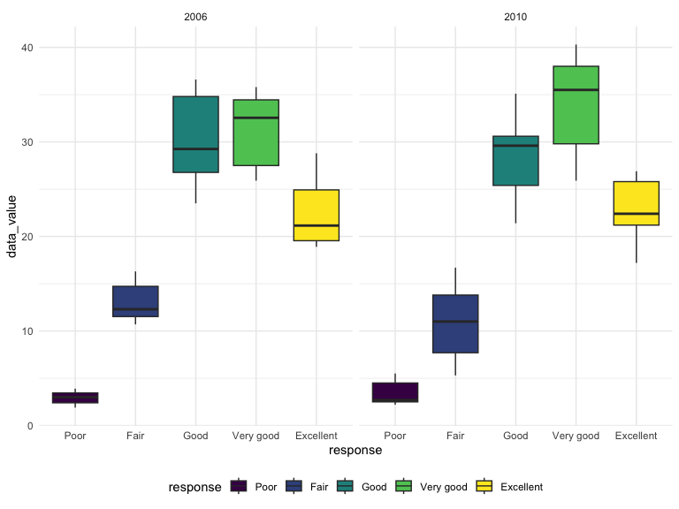

p8105_hw3_zz3168
================
Zixuan Zhang
2023-10-10

``` r
library(p8105.datasets)
data("instacart")
library(tidyverse)
```

    ## ── Attaching core tidyverse packages ──────────────────────── tidyverse 2.0.0 ──
    ## ✔ dplyr     1.1.3     ✔ readr     2.1.4
    ## ✔ forcats   1.0.0     ✔ stringr   1.5.0
    ## ✔ ggplot2   3.4.3     ✔ tibble    3.2.1
    ## ✔ lubridate 1.9.2     ✔ tidyr     1.3.0
    ## ✔ purrr     1.0.2     
    ## ── Conflicts ────────────────────────────────────────── tidyverse_conflicts() ──
    ## ✖ dplyr::filter() masks stats::filter()
    ## ✖ dplyr::lag()    masks stats::lag()
    ## ℹ Use the conflicted package (<http://conflicted.r-lib.org/>) to force all conflicts to become errors

``` r
library(p8105.datasets)
data("brfss_smart2010")
```

### Problem 1

``` r
library(tidyverse)
library(ggridges)
library(patchwork)

library(p8105.datasets)

knitr::opts_chunk$set(
    echo = TRUE,
    warning = FALSE,
    fig.width = 8, 
  fig.height = 6,
  out.width = "90%"
)

theme_set(theme_minimal() + theme(legend.position = "bottom"))

options(
  ggplot2.continuous.colour = "viridis",
  ggplot2.continuous.fill = "viridis"
)

scale_colour_discrete = scale_colour_viridis_d
scale_fill_discrete = scale_fill_viridis_d
```

## Problem 2

``` r
clean_data = 
  brfss_smart2010 |> 
  janitor::clean_names() |> 
  filter(topic == "Overall Health", 
         response %in% c("Excellent", "Very good", "Good", "Fair", "Poor")) |> 
  mutate(
    response =  factor(response, levels = c("Poor", "Fair", "Good", "Very good", "Excellent"))
  ) |> 
  arrange(response)
```

``` r
brfss_state_2002 = 
  clean_data |> 
  filter(year == "2002") |> 
  group_by(locationabbr) |> 
  filter(locationdesc >= 7 )
```

\#construct a dataset

``` r
dataset_exce =
  clean_data |> 
  filter(response == "Excellent") |> 
  group_by(year, locationabbr) |>
  summarize(avg_value = mean(data_value, na.rm = TRUE))
```

    ## `summarise()` has grouped output by 'year'. You can override using the
    ## `.groups` argument.

``` r
ggplot(
  dataset_exce, 
  aes(
    x = year, 
    y = avg_value, 
    group = locationabbr, 
    color = locationabbr )) +
  geom_point() +
  geom_line() +
  labs(
    title = "Average Value of 'Excellent' Responses ", 
    x = "Year",
    y = "Average Value") +
  theme_minimal()
```


\#two-panel plot

``` r
clean_data |> 
  filter(year %in% c(2006, 2010), locationabbr == "NY") |> 
  ggplot(aes(x = response, y = data_value)) +
  geom_boxplot() +
  facet_grid(~year)
```



### Problem 3
